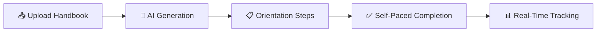
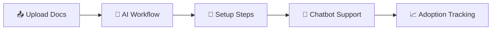
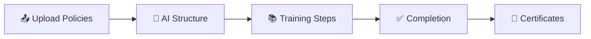
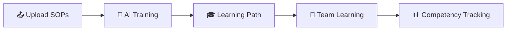

<div align="center">

# 🚀 Onboard Flow

### Transform Company Documents into AI-Powered Onboarding Experiences

[](https://www.typescriptlang.org/)
[](https://reactjs.org/)
[](https://nodejs.org/)
[](https://ai.google.dev/)

**An intelligent onboarding platform leveraging AI to automatically analyze company documents and generate personalized, adaptive onboarding workflows.**

[Features](#-key-features) • [Quick Start](#-quick-start) • [Documentation](#-documentation) • [Use Cases](#-use-cases)

---

</div>

## 🎯 Overview

<table>
<tr>
<td width="50%">

### The Challenge

Traditional onboarding processes face critical limitations:

- ⏱️ **Time-Intensive**: HR teams invest 10-20 hours manually creating onboarding materials
- 💰 **Cost-Prohibitive**: High overhead for setup, maintenance, and ongoing support
- 📊 **Inconsistent Quality**: Variable experiences across employees and departments
- 📄 **Static Content**: Documents fail to guide users or track progress effectively
- ❓ **Limited Support**: New hires encounter obstacles without immediate assistance
- 🔄 **Maintenance Burden**: Materials require constant manual updates to remain current

</td>
<td width="50%">

### Our Solution

**Onboard Flow delivers intelligent automation:**

1. 📤 **Upload** company documents (handbooks, policies, procedures)
2. 🤖 **AI Analysis** 
3. ⚡ **Auto-Generation** of structured, sequential onboarding steps
4. 📋 **Guided Experience** with detailed, actionable instructions
5. 💬 **24/7 AI Assistant** providing instant, context-aware support
6. 📈 **Real-Time Tracking** of progress and completion metrics

</td>
</tr>
</table>

<div align="center">

### 📊 Impact Metrics

| Metric | Improvement |
|:------:|:-----------:|
| ⚡ **Setup Time** | 95% reduction |
| ✅ **Completion Rate** | 80% increase |
| 💰 **Cost Savings** | 90% reduction |
| ⏰ **Time-to-Productivity** | 50% faster |

</div>

---

## ✨ Key Features

<details open>
<summary><b>🤖 AI-Powered Intelligence</b></summary>
<br>

- 📄 **Smart Document Processing** — Upload PDFs and receive structured steps automatically
- 🔄 **Intelligent Sequencing** — AI determines optimal order and dependencies
- 💬 **Context-Aware Chatbot** — 24/7 assistant with comprehensive document knowledge
- 📝 **Adaptive Instructions** — Detailed, actionable guidance for each step

</details>

<details open>
<summary><b>👥 Team Management</b></summary>
<br>
- 🏢 **Team Creation** — Organize users into teams for collaborative onboarding
- 📑 **Team-Based Documents** — Upload and manage team-specific documentation
- 📋 **Document Queue System** — Sequential processing of multiple documents per team
- 👤 **Member Management** — Add/remove team members with real-time notifications
- 🔔 **Team Notifications** — Instant alerts for team membership changes

</details>

<details open>
<summary><b>💬 Support System</b></summary>
<br>
- 🎫 **Query Management** — Submit and track support queries with priority levels
- 📊 **Admin Dashboard** — Centralized support query management for administrators
- 🔔 **Smart Notifications** — Real-time alerts for support responses and status updates
- 💬 **Response System** — Two-way communication between users and support team
- 📈 **Status Tracking** — Monitor query progress from open to resolved
- ❓ **FAQ Section** — Quick answers to common questions

</details>

<details open>
<summary><b>📊 Progress & Analytics</b></summary>
<br>
- ⏱️ **Real-Time Tracking** — Monitor completion percentage and time investment
- 📈 **Maturity Scoring** — Progressive levels from Startup (0-25%) to Enterprise Ready (76-100%)
- 📰 **Activity Feed** — Comprehensive user action tracking with accurate timestamps
- 🎛️ **Admin Dashboard** — Centralized monitoring of users, completion rates, and system metrics
- 📊 **User Analytics** — Granular analytics with step-by-step progress visualization

</details>

<details open>
<summary><b>🎉 Engaging Experience</b></summary>
<br>
- 🖥️ **Three-Panel Interface** — Intuitive layout with sidebar, main content, and properties panel
- 🎊 **Celebration Animations** — Trophy and confetti effects upon completion
- ✨ **Welcome Animation** — Beautiful multi-stage animation for new user registrations
- 👁️ **Password Visibility Toggle** — Eye icon to show/hide passwords on login and register
- 📚 **Onboarding History** — Archive completed flows with PDF report generation
- 📱 **Responsive Design** — Seamless experience across all devices and screen sizes
- ⏯️ **Document Queue UI** — Visual queue management with intuitive play/pause controls

</details>

<details open>
<summary><b>🔒 Enterprise-Ready</b></summary>
<br>
- 🔐 **Secure Authentication** — JWT tokens with bcrypt password hashing
- 👮 **Role-Based Access Control** — Granular permissions for admin and user roles
- 🔔 **Notification System** — Real-time notifications for support queries and team updates
- 💾 **Data Persistence** — File-based JSON storage ensuring data integrity across restarts
- 📂 **Document Management** — Multi-document support per user/team with streamlined deletion
- ⏰ **Activity Timestamps** — Accurate time tracking with persistent storage

</details>

---

## 🚀 Quick Start

<div align="center">

### Prerequisites

| Requirement | Version | Link |
|------------|---------|------|
| Node.js | 18+ | [Download](https://nodejs.org/) |
| Google Gemini API | Latest | [Get API Key](https://aistudio.google.com/app/apikey) |

</div>

### Installation Steps

1. **Clone the repository**
   ```bash
   git clone <repository-url>
   cd onboard-flow
   ```

2. **Install dependencies**
   ```bash
   npm install
   cd server && npm install && cd ..
   ```

3. **Configure environment**
   
   Copy the example environment files and fill in your values:
   
   ```bash
   # Copy frontend environment file
   cp .env.example .env
   
   # Copy backend environment file
   cp server/.env.example server/.env
   ```
   
   Then edit the files with your values:
   
   `.env`:
   ```env
   VITE_API_URL=http://localhost:3001/api
   ```
   
   `server/.env`:
   ```env
   GEMINI_API_KEY=your_api_key_here
   PORT=3001
   JWT_SECRET=your_secret_here
   ```
   
   **Get your Gemini API key:** [https://aistudio.google.com/app/apikey](https://aistudio.google.com/app/apikey)

4. **Start the application**
   
   **Windows:**
   ```bash
   start-dev.bat
   ```
   
   **Mac/Linux:**
   ```bash
   # Terminal 1 - Backend
   cd server && npm run dev
   
   # Terminal 2 - Frontend
   npm run dev
   ```

5. **Access the application**
   
   <table>
   <tr>
   <td><b>Frontend</b></td>
   <td><a href="http://localhost:8080">http://localhost:8080</a></td>
   </tr>
   <tr>
   <td><b>Backend API</b></td>
   <td><a href="http://localhost:3001">http://localhost:3001</a></td>
   </tr>
   </table>

<div align="center">

### 🔑 Default Credentials

| Field | Value |
|-------|-------|
| **Email** | `admin@demo.com` |
| **Password** | `admin123` |

</div>

---

## 💡 How It Works

<table>
<tr>
<td width="50%">

### 👔 For HR Teams & Administrators

#### Traditional Approach
1. ⏳ Review company documents thoroughly
2. ✍️ Manually create onboarding steps (10-20 hours)
3. 📝 Write detailed instructions for each step
4. 🔄 Update materials when policies change
5. 💬 Respond to constant questions from new hires
6. 📊 Manually track completion status

#### With Onboard Flow
1. ⚡ Upload company document (5 minutes)
2. 🤖 AI generates complete workflow automatically
3. 👥 Users follow guided steps with AI assistance
4. 📈 Track progress via real-time dashboard
5. 💬 Get instant support through integrated help center
6. 📄 Download completion reports instantly

<div align="center">

**⏱️ Time Saved: 95%** | **💰 Cost Reduction: 90%**

</div>

</td>
<td width="50%">

### 👤 For New Employees

#### Traditional Approach
- 📚 Read 50+ page documents
- ❓ Unclear prioritization and sequencing
- 🚫 Get stuck without immediate assistance
- ⏰ Wait for HR responses
- 📉 No progress tracking or visibility

#### With Onboard Flow
- ✅ Clear step-by-step guidance
- 🎯 AI-determined optimal sequence
- 💬 Instant chatbot assistance 24/7
- 🎫 Built-in support center for queries
- 📊 Real-time progress visibility
- 🎉 Celebration upon completion

<div align="center">

**📈 Completion Rate: 80% Higher**

</div>

</td>
</tr>
</table>

---

## 🛠️ Technology Stack

<div align="center">

### Frontend Architecture

| Technology | Purpose | Version |
|-----------|---------|---------|
|  | UI Framework | 18.x |
|  | Type Safety | 5.x |
|  | Build Tool | Latest |
|  | Styling | 3.x |
|  | Navigation | 6.x |

### Backend Architecture

| Technology | Purpose | Version |
|-----------|---------|---------|
|  | Runtime | 18+ |
|  | Web Framework | 4.x |
|  | AI Engine | 2.5 Flash |
|  | Authentication | Latest |

### Development Tools

- 📄 **PDF Parsing** — Document text extraction
- 📊 **jsPDF** — Report generation
- 🔍 **Comprehensive Error Handling** — Production-ready error management
- 🔥 **Hot Module Replacement** — Instant development feedback

</div>

---

## 📁 Project Structure

```
onboard-flow/
├── src/                          # Frontend React application
│   ├── components/               # Reusable UI components
│   │   ├── onboarding/          # Onboarding-specific components
│   │   │   ├── ArchivedFlows.tsx
│   │   │   ├── OnboardingChatbot.tsx
│   │   │   └── StepContent.tsx
│   │   ├── ui/                  # shadcn/ui components
│   │   ├── BrowserChrome.tsx    # Browser-like UI wrapper
│   │   ├── NavLink.tsx          # Navigation component
│   │   ├── NotificationPopup.tsx # Real-time notifications
│   │   └── WelcomeAnimation.tsx # New user welcome animation
│   ├── contexts/                # React contexts
│   │   └── AuthContext.tsx      # Authentication context
│   ├── hooks/                   # Custom React hooks
│   │   └── use-toast.ts         # Toast notifications
│   ├── lib/                     # Utilities and API client
│   │   ├── api.ts               # API client functions
│   │   ├── types.ts             # TypeScript type definitions
│   │   └── utils.ts             # Utility functions
│   ├── pages/                   # Page components
│   │   ├── AccountPage.tsx      # User account management
│   │   ├── AnalyticsPage.tsx    # Admin analytics dashboard
│   │   ├── DashboardPage.tsx    # Main dashboard
│   │   ├── LandingPage.tsx      # Public landing page
│   │   ├── LoginPage.tsx        # Login page
│   │   ├── OnboardingPage.tsx   # Onboarding workflow
│   │   ├── RegisterPage.tsx     # Registration page
│   │   ├── SupportPage.tsx      # Support center & query management
│   │   ├── TeamsPage.tsx        # Team management
│   │   └── UploadPage.tsx       # Document upload
│   ├── test/                    # Test files and setup
│   ├── App.tsx                  # Main app component
│   └── main.tsx                 # Application entry point
├── server/                       # Backend Express API
│   ├── src/
│   │   ├── middleware/          # Express middleware
│   │   │   └── auth.ts          # JWT authentication
│   │   ├── routes/              # API routes
│   │   │   └── auth.ts          # Auth routes
│   │   ├── services/            # Business logic
│   │   │   ├── database.ts      # File-based database
│   │   │   └── gemini.ts        # Google Gemini AI integration
│   │   ├── types/               # TypeScript type definitions
│   │   └── index.ts             # Server entry point
│   ├── data/                    # JSON database storage
│   │   └── database.json        # Persistent data file
│   └── package.json             # Server dependencies
├── public/                       # Static assets
│   ├── favicon.ico              # App favicon
│   ├── favicon.svg              # SVG favicon
│   └── placeholder.svg          # Placeholder image
├── start-dev.bat                # Windows startup script
├── DOCUMENTATION.md             # Technical documentation
├── CHANGELOG.md                 # Version history
└── README.md                    # This file
```

---

## 📚 Documentation

<div align="center">

| Document | Description |
|----------|-------------|
| 🔧 [**DOCUMENTATION.md**](./DOCUMENTATION.md) | Comprehensive technical documentation and API reference |
| 📝 [**CHANGELOG.md**](./CHANGELOG.md) | Version history and release notes |

### Quick Navigation

**New to the project?** Start with this README for a complete overview  
**Need technical details?** Consult [DOCUMENTATION.md](./DOCUMENTATION.md)  
**Track updates?** Review [CHANGELOG.md](./CHANGELOG.md)

</div>

---

## 🎯 Use Cases

<table>
<tr>
<td width="50%">

### 👥 Employee Onboarding

**Ideal for:** New hire orientation, role-specific training

</td>
<td width="50%">

### 🤝 Customer Onboarding

**Ideal for:** Product adoption, customer success programs

</td>
</tr>
<tr>
<td width="50%">

### 📜 Compliance Training

**Ideal for:** Regulatory compliance, policy acknowledgment

</td>
<td width="50%">

### 📋 Process Documentation

**Ideal for:** Standard operating procedures, skill development

</td>
</tr>
</table>

<div align="center">

### 🌐 Partner Onboarding

**Upload partner guidelines** → **AI generates integration steps** → **Independent completion** → **Partnership readiness monitoring**

*Ideal for: Channel partners, vendor onboarding, integration programs*

</div>

---

## 📊 Impact & Benefits

<div align="center">

### Business Value Proposition

</div>

<table>
<tr>
<td width="25%" align="center">

### ⚡ Time Efficiency

**95%** faster onboarding creation

20 hours → 5 minutes

---

**80%** reduction in support time

Chatbot handles inquiries

---

**50%** faster employee ramp-up

Structured learning paths

</td>
<td width="25%" align="center">

### 💰 Cost Savings

**90%** reduction in onboarding costs

Automated workflow generation

---

**Zero** ongoing maintenance

AI-powered updates

---

**Infinite** scalability

Same effort: 1 or 1,000 users

</td>
<td width="25%" align="center">

### ✨ Quality Improvements

**100%** consistency

Uniform experience for all users

---

**80%** higher completion rates

Engaging, guided experience

---

**24/7** availability

Always-on AI assistance

</td>
<td width="25%" align="center">

### 📈 ROI

**Positive return** within first month

---

**Immediate** time savings

---

**Reduced** support burden

---

**Improved** employee satisfaction

</td>
</tr>
</table>

---

## 🐛 Troubleshooting

<details>
<summary><b>🔴 Backend Won't Start</b></summary>

- ✅ Verify port 3001 availability:
  - **Windows:** `netstat -ano | findstr :3001`
  - **Mac/Linux:** `lsof -i :3001`
- ✅ Confirm Gemini API key in `server/.env`
- ✅ Ensure Node.js 18+ is installed: `node --version`
- ✅ Check server logs for specific error messages

</details>

<details>
<summary><b>🔴 Frontend Won't Start</b></summary>

- ✅ Verify port 8080 availability
- ✅ Install dependencies: `npm install`
- ✅ Clear npm cache: `npm cache clean --force`
- ✅ Delete `node_modules` and reinstall if issues persist

</details>

<details>
<summary><b>🔴 Document Upload Fails</b></summary>

- ✅ Confirm backend is running on port 3001
- ✅ Validate Gemini API key configuration
- ✅ Ensure PDF contains readable text (not scanned images)
- ✅ Check browser console for detailed error messages
- ✅ Verify file size is within acceptable limits

</details>

<details>
<summary><b>🔴 Authentication Issues</b></summary>

- ✅ Clear browser localStorage
- ✅ Verify JWT_SECRET is configured in `server/.env`
- ✅ Confirm `database.json` exists in `server/data/`
- ✅ Check token expiration (7-day validity)

</details>

<div align="center">

📖 For comprehensive troubleshooting, consult [DOCUMENTATION.md](./DOCUMENTATION.md)

</div>

---

## 🔮 Future Roadmap

<table>
<tr>
<td width="33%">

### 🌍 Global Expansion
- 🌐 Multi-language support
- 🌏 Localization for global teams
- 🕐 Timezone management
- 📍 Regional compliance

</td>
<td width="33%">

### 🎓 Enhanced Learning
- 🎥 Video step instructions
- 📝 Interactive quizzes
- 🏆 Gamification elements
- 📊 Learning analytics

</td>
<td width="33%">

### 🔗 Integrations
- 📧 Email notifications
- 💬 Slack/Teams integration
- 🔐 SSO (SAML, OAuth)
- 🔌 Third-party API

</td>
</tr>
<tr>
<td width="33%">

### 🎨 Customization
- 🎨 Custom branding
- 📱 Mobile native apps
- 🖼️ Template library
- ⚙️ Workflow customization

</td>
<td width="33%">

### 📈 Advanced Analytics
- 📊 Advanced reporting
- 🎯 Predictive analytics
- 📉 Trend analysis
- 💡 AI-powered insights

</td>
<td width="33%">

### 🚀 Enterprise Features
- 👥 Bulk user import
- 🏢 Multi-tenant support
- 🔒 Advanced security
- 📋 Audit logging

</td>
</tr>
</table>

---

## 🏆 Why Onboard Flow?

### Competitive Advantages
1. **AI-First Approach** - Intelligent transformation, not just digitization
2. **Zero Setup Time** - Upload and go, no configuration needed
3. **Built-in Assistant** - Chatbot reduces support burden by 80%
4. **Complete Solution** - Everything needed in one platform
5. **Modern Technology** - Built with latest tools and best practices
6. **Open Architecture** - Easy to customize and extend

### Success Metrics
| Metric | Improvement |
|--------|-------------|
| Setup Time | 95% reduction |
| Completion Rate | 80% increase |
| Time-to-Productivity | 50% faster |
| Cost | 90% savings |
| Consistency | 100% |
| Availability | 24/7 |

---

<div align="center">

## 🤝 Contributing

We welcome contributions from the community! Please review our contributing guidelines before submitting pull requests.

---

## 📝 License

**Proprietary Software** — All rights reserved

---

## 💬 Support & Contact

For questions, issues, or feature requests:

- 📖 Review [DOCUMENTATION.md](./DOCUMENTATION.md) for technical guidance
- 📋 Consult this README for feature information
- 📧 Contact the development team for additional support

---

## 🌟 Acknowledgments

Built with industry-leading technologies:

[](https://ai.google.dev/)
[](https://react.dev/)
[](https://ui.shadcn.com/)
[](https://tailwindcss.com/)

---

<table>
<tr>
<td align="center" width="33%">

### 📦 Version
**1.0.0**

</td>
<td align="center" width="33%">

### ✅ Status
**Production-Ready**

</td>
<td align="center" width="33%">

### 🏗️ Built With
**❤️ & AI**

</td>
</tr>
</table>

---

### 🚀 Transform Your Onboarding Process

**From hours to minutes. From manual to intelligent. From static to adaptive.**

*Experience the future of onboarding with Onboard Flow.*

---

<sub>© 2024 Onboard Flow. Powered by cutting-edge AI technology.</sub>

</div>
